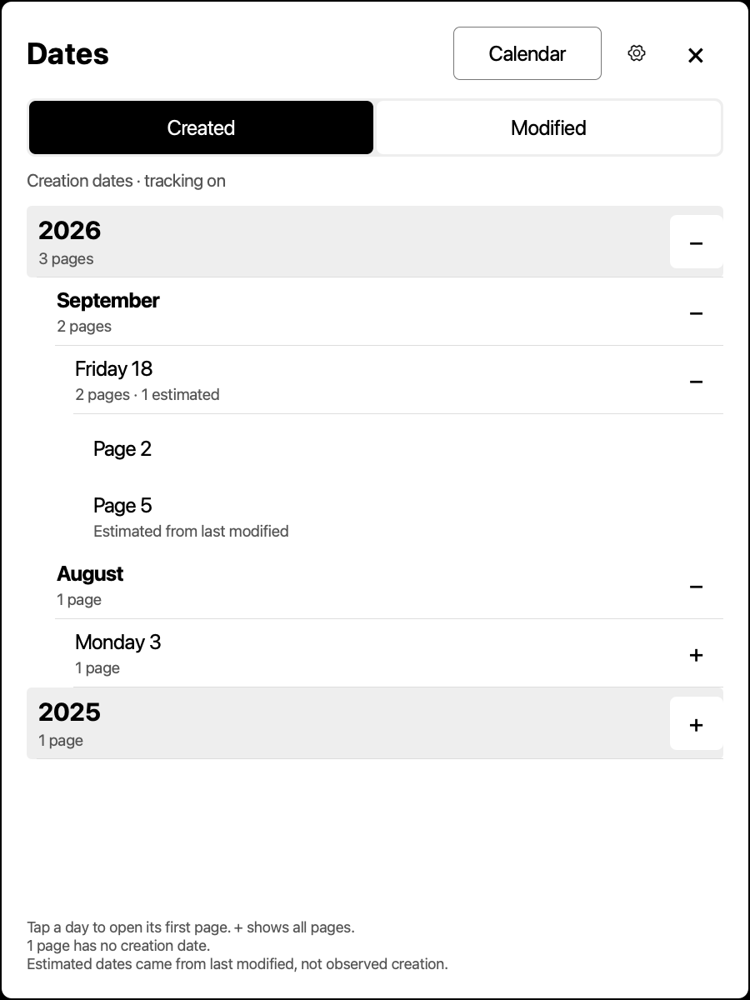
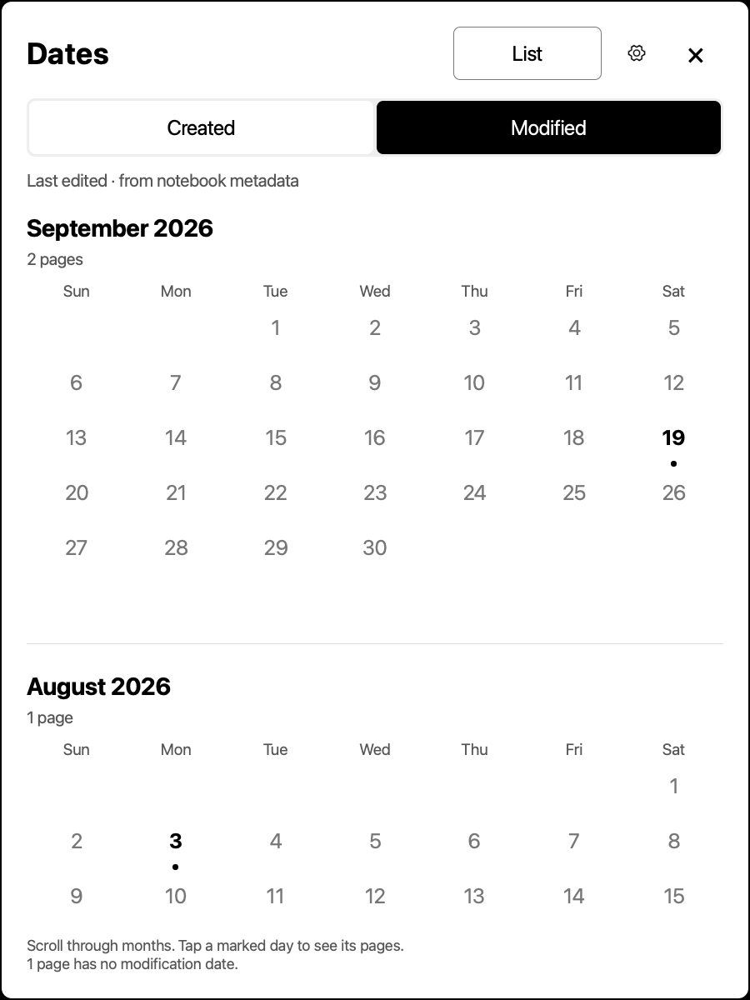

# Notebook Dates

**Find the page by the day.** A separate date navigator for reMarkable
notebooks—without adding headings, changing your table of contents, or touching
your handwriting.

On **Paper Pro**, open a notebook and tap the **calendar icon above BetterTOC**
in the sidebar. On **Move**, use **⋮ → Dates**. Browse by **Created** or **Modified**;
the compact **Calendar / List** button in the header switches the layout.
Pro also retains the menu entry when a short toolbar has no room for the icon.
The interface is designed for e-ink: readable type, generous touch targets,
quiet separators, and no animation-dependent controls.



> **Beta software, exact firmware only.** This branch targets **Paper Pro / Ferrari
> 3.28.0.169**. It is not a general reMarkable installer and is not yet qualified
> for Paper Pro Move. Do not bypass compatibility checks to install it elsewhere.

## Two useful ways to find a page

| View | Date source | Needs tracking? | What changes after editing? |
| --- | --- | --- | --- |
| **Created** | Successful page-creation observations recorded by Dates | Yes, for future pages | Nothing: the recorded creation day stays put |
| **Modified** | The notebook's own saved per-page last-modification metadata | No | The page moves to its latest saved modification day |

Days sit inside collapsible months. If a notebook spans multiple years, years
become the outer level. Recent history is open first; older sections can be
expanded when needed. **Tap a day** to open its first surviving page. Tap **+**
to reveal all the pages for that day, then tap a page to go directly to it.
Page links use stable IDs, so reordering does not break them. Deleted pages are
hidden; undo can reveal their original dates again.

### Or browse a calendar

Tap **Calendar** in the header without changing your Created/Modified choice. Scroll through
months, newest first; a **black dot** marks each day with matching pages. Tap a
marked day to choose a page. **Back to months** returns to the same scroll
position. Empty intervening months remain visible, and weeks start on Sunday.
Tap **List** in the same place whenever a compact hierarchy is more useful.
After selecting a day in **Modified → Calendar**, pages are ordered by their
current page number, not by which page was edited most recently.



Both layouts show exactly the same available pages. Calendar browsing does not
enable tracking, invent dates, or modify notebook content.

Modified is a *latest-edit view*, not a complete edit log. It refreshes when you
open Dates or switch views. A still-unsaved edit may not appear until reMarkable
has saved its metadata. Missing timestamps stay undated.

## Turn on creation tracking

1. Open **Dates → ⚙** in the notebook you want to track.
2. Optionally select **Include undated pages using last-modified dates (estimates)**.
3. Tap **Enable for this notebook**.

The optional checkbox starts **off**. It takes a one-time snapshot for pages
without a saved creation date. These entries remain visibly **estimated**:
last modified is useful historical information, but it is not proof of when a
page was created. Existing creation dates are never overwritten, missing dates
are not invented, and later editing does not move a saved estimate.

Tracking is per notebook and per tablet. **Pause tracking** keeps existing
history and stops dating new pages. Re-enabling offers the same optional
baseline for still-undated pages. Notebook copies have different IDs and do not
inherit tracking automatically. Imported/moved-in pages are not mistaken for
newly created pages; you may explicitly include them in a later baseline.

The Created view and the regular table of contents are independent. This app
does not add native tags or TOC entries and does not alter PDF outlines.

## Settings stay out of the way

The **gear inside Dates** contains tracking, the optional baseline, timezone,
and date-history sync status. Settings scroll if the available height is small.

The default timezone is **Asia/Jerusalem**, including Israel daylight-saving
rules. Changing it re-groups Modified view immediately and affects future
creation observations/estimates. Previously stored creation days do not move.
The tablet system clock is never changed.

For an IANA timezone not in the menu, use the private device-local settings file:

```json
{"schema":1,"timezone":"Europe/Paris"}
```

Path: `/home/root/.local/share/notebook-date-index/settings.json`. Preserve its
private permissions and replace it atomically. Settings take effect on the next
request. Pro and Move settings are independent, even when history is shared.

## Optional sync—your server, your configuration

Dates works **offline and without a server**. There is no built-in personal
server address and no fallback to someone else's account. Without `sync.json`,
the tablet service stays local-only.

The optional self-hosted hub exchanges only creation-history metadata:
notebook/page UUIDs, recorded times, calendar days, offsets, timezones, estimate
flags and originating device names. It does **not** send handwriting, document
text, titles or PDF contents. Modified view is read locally and is not uploaded;
an explicitly saved creation estimate may be synced as creation-history metadata.

Native reMarkable cloud sync continues unchanged. The hub does not sync notebook
content: the same notebook/page IDs must already exist on both devices. Dates
merges offline observations rather than replacing one device's whole index.
Recorded creation wins over an estimate; remaining conflicts use earliest UTC
and a deterministic tie-break while retaining every observation in the journal.
Incorrect device clocks cannot be repaired automatically.

### Self-host the hub

Use the **same current source revision** for hub and clients. Earlier hubs do
not understand estimates; upgrade the hub before sending estimated records.
One hub history namespace is for **one trusted owner/device group**, not an
untrusted multi-user hosting service.

Build for your server architecture (example: Linux x86-64):

```sh
CGO_ENABLED=0 GOOS=linux GOARCH=amd64 go build -trimpath -o notebook-date-index .
```

On the server, create a private data directory and generate fresh credentials:

```sh
./notebook-date-index \
  --init-sync-credentials "$HOME/.local/share/notebook-date-sync/credentials" \
  --sync-endpoint https://dates.example.com/dates/v1/exchange \
  --devices my-pro,my-move,probe
```

**Replace the example domain with yours.** The endpoint is required, must use
HTTPS, and must end in `/dates/v1/exchange`. Device names are unique lowercase
letters/digits/hyphens, beginning with a letter, up to 40 characters. `probe` is
a reserved isolated test namespace. Credential generation refuses to overwrite
existing files. It writes a hashed `devices.json` for the hub and a separate
private `<device>-client.json` with a random token for each client; it does not
print tokens.

Run the hub behind a TLS reverse proxy:

```sh
./notebook-date-index --sync-server \
  --data "$HOME/.local/share/notebook-date-sync/history" \
  --credentials "$HOME/.local/share/notebook-date-sync/credentials/devices.json"
```

It listens on **127.0.0.1:18743**, not a public interface. See the
[portable user-service example](examples/notebook-date-sync.service) and
[nginx location](ops/dates-sync-location.conf). Create the history directory and
install the binary at the paths in the service before enabling it. Keep data
directories mode 0700 and credential files mode 0600. Do not disable TLS
verification, expose the loopback service directly, or enable request-body logs.
Redirects are deliberately refused by clients.

### Configure each qualified tablet

Securely copy that device's generated `<device>-client.json` to:

```text
/home/root/.local/share/notebook-date-index/sync.json
```

The [example configuration](examples/sync.json) shows the shape, not usable
credentials. Each tablet needs its own token/device name. Restart **only the
Dates service** through your device's qualified recipe to load a changed sync
configuration; this does not itself require a tablet UI restart. Existing
configuration is not regenerated by app updates.

The background worker starts promptly when a notebook is viewed or a creation
record changes, and retries roughly every minute. Dates settings shows the
status for the current notebook; reopen Dates to refresh it. Offline errors do
not block writing or local navigation. A received
record is visible only when its matching page is available locally. Tracking
switches, timezone choices, and unrelated preferences are not synchronized.

**Current deployment status:** Calendar is installed on the maintainer's Pro,
and its Dates history now syncs to the upgraded private hub. A real notebook's
three creation records were verified through HTTPS using the Move's credentials.
The physical Move is currently unreachable and has not received the Dates app;
two-tablet delivery and physical acceptance are still pending. Its saved .169
firmware composition passes offline, but that is not a live-device qualification.

## Installation, updates and recovery

This is an unofficial XOVI/QMLDiff extension, not supported by reMarkable.
The qualified Pro uses the standalone Dates service and an external QML panel.
It coexists with BetterTOC and the separately maintained RMStream shortcut.

Read [UPDATE-RECIPE.md](UPDATE-RECIPE.md) before changing a device. The current
v3 → Calendar/sync upgrade is deliberately narrow: exact model/firmware/runtime/old-payload
hashes, a private off-device backup, independent timed rollback, and a guarded UI
restart for the calendar panel/helper. Sync then updates only the Dates service
and its private config, preserving the UI process. All ten installed QMDs stay
unchanged. Historical initial-install scripts are **not** suitable for
the current ten-QMD inventory. Host-qualified scripts in `ops/` are maintainer
runbooks, not a one-command installer for arbitrary tablets or servers.

All app payload and data live below `/home/root`; no bootloader, firmware,
kernel, stock executable or root-filesystem modification is required. Runtime
services are transient. A reboot may require deliberate guarded reactivation;
an OS update requires new exact-version qualification. No hack is risk-free.

**Back up the whole directory** `/home/root/.local/share/notebook-date-index/`.
It contains private tokens, device settings, per-notebook indexes, atomic
`.previous` backups, and optional sync journals. Keep backups encrypted/private
and out of Git. Normal notebook backups do not include this separate history.

New index writes use **schema 2**, retaining schema-1 read compatibility.
Do not run an old writer against schema-2 data. Emergency v3 rollback stops
Dates and preserves current history; recover with a schema-2-aware binary rather
than blindly restoring an old data archive. Pausing is the everyday way to
stop tracking without deleting anything. Removal should disable the Dates QMD
and service through a qualified guarded recipe, while retaining the data folder.

## Develop and maintain

Run `./test.sh` with Go, Node.js, Qt 6 tools, and the exact firmware resource
cache described in the update recipe. Tests include Go race/security/storage
tests, read-only metadata/backfill/provenance tests, real Qt HTTP transport,
creation-callback isolation, hierarchical UI/navigation checks, QMLDiff
composition, wrong-firmware rejection and a static ARM64 build. Rendered test
images use synthetic data, never a user's notebook.

This branch deliberately relies on a sibling exact-firmware cache and reviewed
co-resident QMD manifest. It does not redistribute stock firmware resources or
pretend an adjacent beta is compatible. Paper Pro Move requires its own branch,
resources, controller and physical acceptance.

- [Design and main functions](design.md)
- [Product requirements and next steps](prd.org)
- [Compatibility matrix](compatibility.json)
- [Branch/upstream maintenance](MAINTENANCE.md)
- [Private-hub deployment evidence and remaining rollout](SYNC-DEPLOYMENT.md)

Project: [guibor/notebook-date-index](https://github.com/guibor/notebook-date-index).
Dates owns its own repository; RMStream customizations belong to their separate
upstream-tracking fork.
